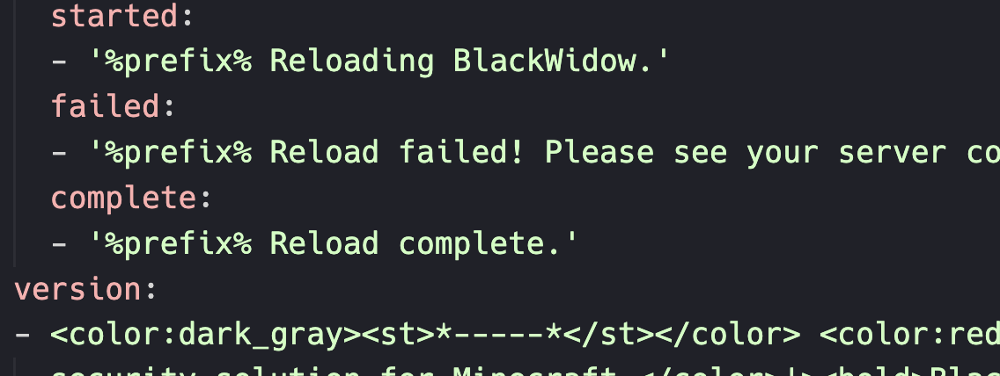
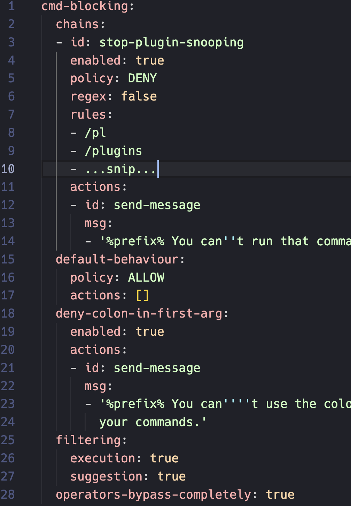

# BlackWidow

BlackWidow is a security solution for Minecraft which aims to
offer out-of-the-box defense against vulnerabilities which
are commonly exploited on online servers.

## Quick Links

- **Get Support / Contact Us**

  Please join the [ArcanePlugins Discord](https://discord.gg/arcaneplugins-752310043214479462) and use
  the `#other-lokka30-plugins` channel.

  Alternatively, [please message lokka30](https://www.spigotmc.org/conversations/add?to=lokka30) on SpigotMC.

- **Documentation**

  View the [BlackWidow Wiki](https://github.com/ArcanePlugins/BlackWidow/wiki).

- **Source Code**

  View the [BlackWidow Repository](https://github.com/ArcanePlugins/BlackWidow).

- **Project Tracker / Roadmap**

  View the [BlackWidow Project](https://github.com/orgs/ArcanePlugins/projects/5).

## Features

- **Command Blocking**

  Featuring a comprehensive command blocker, supporting blacklist/whitelisting, regex, powerful custom command rule
  chains, colon syntax blocking (`/plugin:command`), and more.

  The default configuration blocks common commands used by players to check installed plugins and versions.

- **Secure Defaults**

  The default configuration of BlackWidow provides immediate drag-and-drop security improvements for most servers.

- **Unit Testing**

  Standard component logic, such as the Command Blocking logic, is unit-tested to ensure it is working correctly before
  any version can be shipped out.

- **Simple & Reliable**

  BlackWidow is built to be robust and lightweight, and doesn't mash half-baked features together to seem appealing (
  ..only to break next update).

- **Plenty more to come!**

  There are a [variety of other features](https://github.com/orgs/ArcanePlugins/projects/5) planned, some major, such as
  command spying. It has the goal of being a pretty comprehensive security suite.

  However, we currently have no plans for BlackWidow to become an 'anticheat' plugin in the usual sense, which seems to
  be fulfilled by existing solutions well enough.

Feel free to see a variety of screenshots below:

<table>

<tr>
<td>

#### Blocking working for command execution and suggestions.

#### Translate all of the plugin's chat messages with MiniMessage color support.

</td>
<td>

#### Very powerful command blocker with a fantastic out-of-the-box experience.

</td>
</tr>

</table>

## Get Started

### Compatibility

Firstly, make sure your software setup is compatible with BlackWidow.

Please reference the [Requirements](https://github.com/ArcanePlugins/BlackWidow/wiki/Requirements) page for the most
up-to-date and descriptive information on the requirements of running BlackWidow.

The best-case scenario to run BlackWidow is:

- [x] **Minecraft 1.21.3** or newer
- [x] **PaperMC** or **SpigotMC** server software
- [x] **Java 21** or newer

Please be advised:

> We are considering adding future support for Velocity, BungeeCord, and Minestom. Let us know if you're interested!

> Derivatives of Spigot/Paper, such as Purpur or Pufferfish may work fine, but we don't support these setups. That being
> said, still give it a shot and see if everything works. :)

> Please note that we are not interested in backporting BlackWidow to older versions of Minecraft/Java/etc. Please
> update your software, or feel free to fork BlackWidow and backport it.

> **We do NOT recommend** using any server software like Magma, Mohist, and Arclight which *try* to make Forge mods work
> with Bukkit plugins. Bukkit was *never* designed to work with Forge/Fabric/etc mods. Trying to mix the two often causes
> lots of unusual issues which burden server owners and plugin maintainers.

## Projects Used

Thank you to the following projects for making BlackWidow possible:

- [**CommandAPI**](https://github.com/JorelAli/CommandAPI)

  Used to conveniently create and manage Brigadier commands.

- [**Configurate**](https://github.com/SpongePowered/Configurate/)

  Used to seamlessly handle YAML configuration files.

- [**MiniMessage (adventure)**](https://github.com/KyoriPowered/adventure)

  Used to format chat messages with lovely chat component features.

- [**PaperMC**](https://papermc.io)

  API used on Paper servers for more advanced features.

Thanks to all the other projects used, such as SpigotMC, IntelliJ, etc.

## License Notice

Copyright (C) 2024 lokka30 ([email](mailto:lachy@lachy.space))

> This program is free software: you can redistribute it and/or modify
> it under the terms of the GNU General Public License as published by
> the Free Software Foundation, either version 3 of the License, or
(at your option) any later version.
>
> This program is distributed in the hope that it will be useful,
> but WITHOUT ANY WARRANTY; without even the implied warranty of
> MERCHANTABILITY or FITNESS FOR A PARTICULAR PURPOSE. See the
> GNU General Public License for more details.

You should have [received a copy](LICENSE.md) of the GNU General Public License
along with this program. If not, see <https://www.gnu.org/licenses/>.
